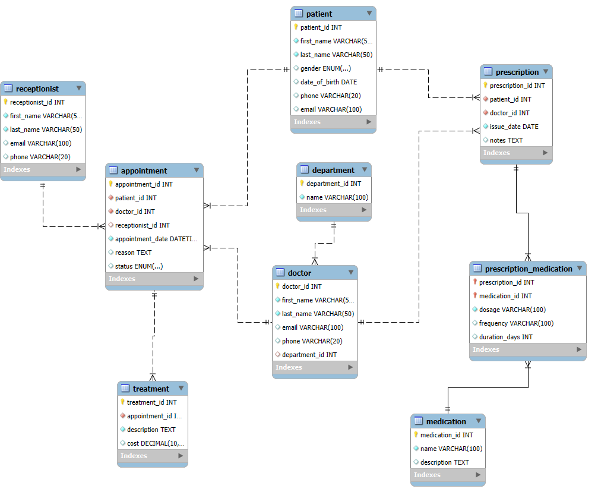

PROJECT TITLE : CLINIC BOOKING MANAGEMENT SYSTEM

###Project Description – Clinic Booking System.
The Clinic Booking System  is built to handle the core functionalities of a clinic management system. It provides efficient APIs for:

(a)Managing patients, doctors, and receptionists.

(b)Scheduling and managing appointments.

(c)Tracking treatments and issuing prescriptions.

(d)Storing data in a relational MySQL database.

###Set Up the MySQL Database
The first step is to set up your MySQL database with the necessary tables and relationships. The SQL file clinic_db.sql contains all the queries to create the database and tables.

Using MySQL Workbench:
(a)Open MySQL Workbench.

(b)Connect to your MySQL server.

(c)Open the clinic_db.sql file in MySQL Workbench.

(d)Run the script to create the database and all the required tables.